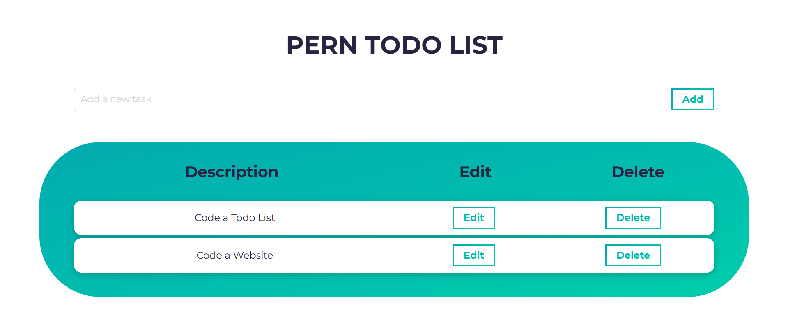

# 📝 Todolist Application

A full-stack web application to save tasks on a server.  
Built with a **React** frontend and a **Node.js** backend using the **PERN stack** (PostgreSQL, Express.js, React, Node.js).

🔗 **Live Demo:** [todolist.benjamindettling.ch](https://todolist.benjamindettling.ch)

---

## ✨ Features

- 🖊️ **Create, Read, Update, Delete (CRUD)** operations for tasks
- 📋 Organize tasks with categories and due dates
- 🔔 Set reminders for upcoming tasks
- 🌐 Responsive design for seamless use on various devices
- 🔒 Secure user authentication and authorization
- 📊 Track task completion statistics

---

## 🛠 Tech Stack

**Frontend**
- React
- Vite
- SCSS Modules

**Backend**
- Node.js
- Express.js
- PostgreSQL
- Sequelize (ORM)

---

## 📂 Project Structure

- [`todolist-client`](https://github.com/benjamindettling/todolist-client)  
  → React application providing the user interface for task management

- [`todolist-server`](https://github.com/benjamindettling/todolist-server)  
  → Express.js server handling API requests and managing the PostgreSQL database

---

## 📸 Screenshot

  

---

## 💡 Challenges & Learnings

- 🚀 Built my **first full-stack application** using the PERN stack (PostgreSQL, Express, React, Node.js)
- 🧱 Learned how to structure a project with a separate frontend and backend
- 🗃️ Designed a PostgreSQL database and connected it to a Node.js API using Express
- 🎨 Practiced styling with **SCSS Modules** for clean and reusable styles
- 🌐 Gained experience deploying full-stack apps to production using Netlify and Render

> This project was my introduction to PERN-stack web development and laid a nice foundation for future React + backend projects.

